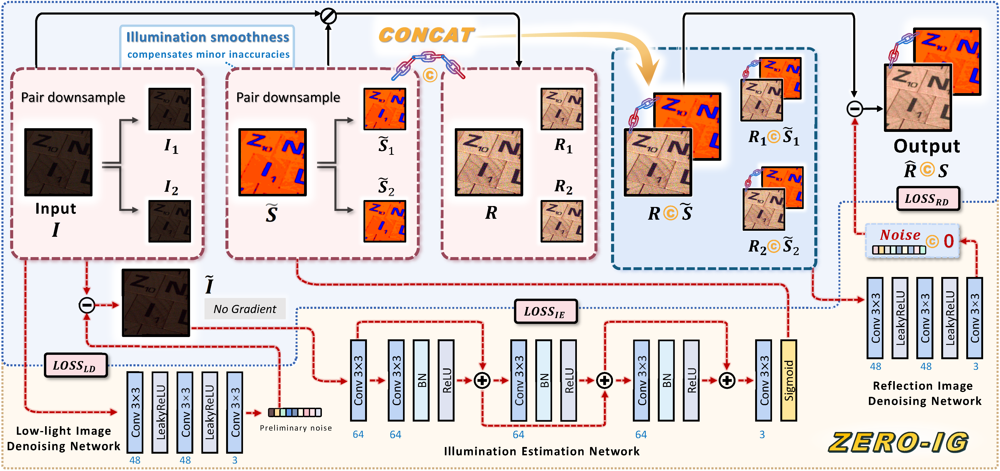

# ZERO-IG

### Zero-Shot Illumination-Guided Joint Denoising and Adaptive Enhancement for Low-Light Images [cvpr2024]

By Yiqi Shi, Duo Liu, LiguoZhang,Ye Tian, Xuezhi Xia, Xiaojing Fu


#[[Paper]](https://openaccess.thecvf.com/content/CVPR2024/papers/Shi_ZERO-IG_Zero-Shot_Illumination-Guided_Joint_Denoising_and_Adaptive_Enhancement_for_Low-Light_CVPR_2024_paper.pdf)   [[Supplement Material]](https://openaccess.thecvf.com/content/CVPR2024/supplemental/Shi_ZERO-IG_Zero-Shot_Illumination-Guided_CVPR_2024_supplemental.pdf)

# Zero-IG Framework

 
<p style="text-align:justify">Note that the provided model in this code are not the model for generating results reported in the paper.

## Model Training Configuration
* To train a new model, specify the dataset path in "train.py" and execute it. The trained model will be stored in the 'weights' folder, while intermediate visualization outputs will be saved in the 'results' folder.
* We have provided some model parameters, but we recommend training with a single image for better result.

## Requirements
* Python 3.7
* PyTorch 1.13.0
* CUDA 11.7
* Torchvision 0.14.1

## Testing
* Ensure the data is prepared and placed in the designated folder.
* Select the appropriate model for testing, which could be a model trained by yourself.
* Execute "test.py" to perform the testing.

## [VILNC Dataset](https://pan.baidu.com/s/1-Uw78IxlVAVY_hqRRS9BGg?pwd=4e5c )

The Varied Indoor Luminance & Nightscapes Collection (VILNC Dataset) is a meticulously curated assembly of 500 real-world low-light images, captured with the precision of a Canon EOS 550D camera. This dataset is segmented into two main environments, comprising 460 indoor scenes and 40 outdoor landscapes. Within the indoor category, each scene is represented through a trio of images, each depicting a distinct level of dim luminance, alongside a corresponding reference image captured under normal lighting conditions. For the outdoor scenes, the dataset includes low-light photographs, each paired with its respective normal light reference image, providing a comprehensive resource for analyzing and enhancing low-light imaging techniques.

 
<p style="text-align:justify">


## Citation
```bibtex
@inproceedings{shi2024zero,
  title={ZERO-IG: Zero-Shot Illumination-Guided Joint Denoising and Adaptive Enhancement for Low-Light Images},
  author={Shi, Yiqi and Liu, Duo and Zhang, Liguo and Tian, Ye and Xia, Xuezhi and Fu, Xiaojing},
  booktitle={Proceedings of the IEEE/CVF Conference on Computer Vision and Pattern Recognition},
  pages={3015--3024},
  year={2024}
}

```

